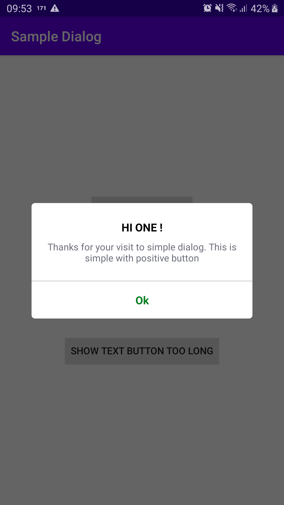
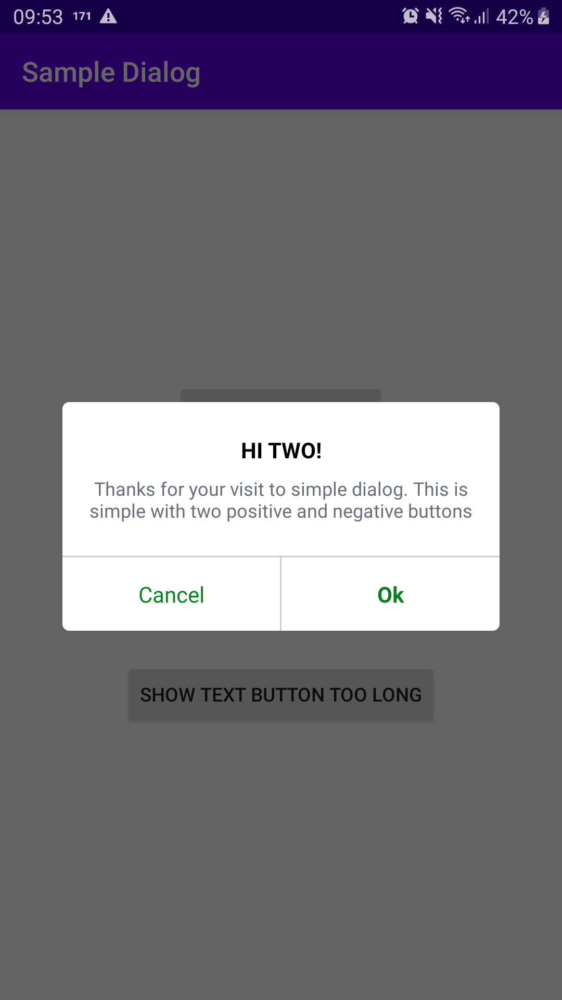
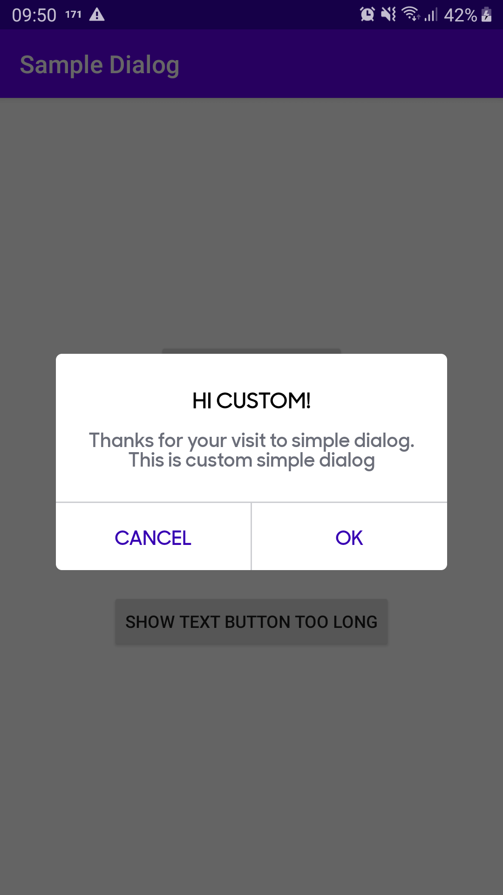
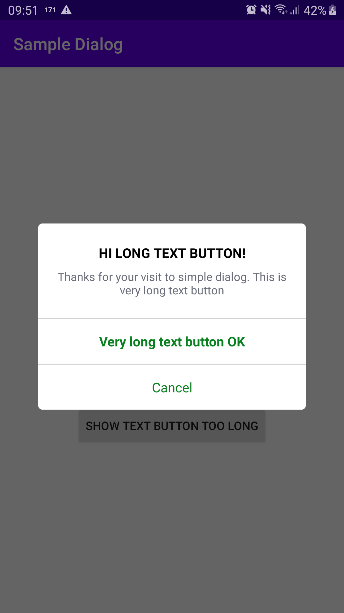
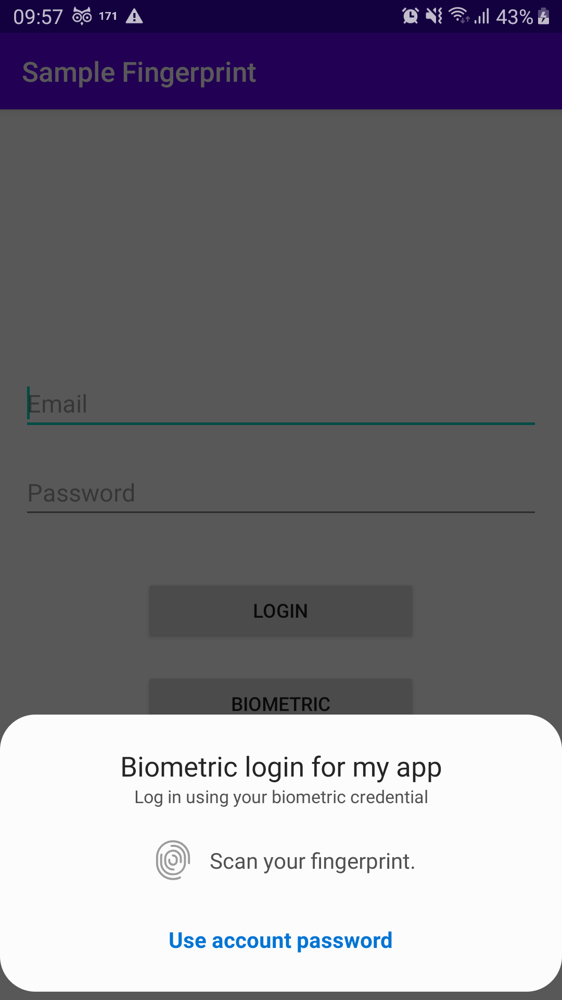
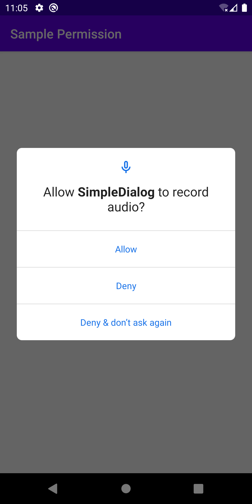
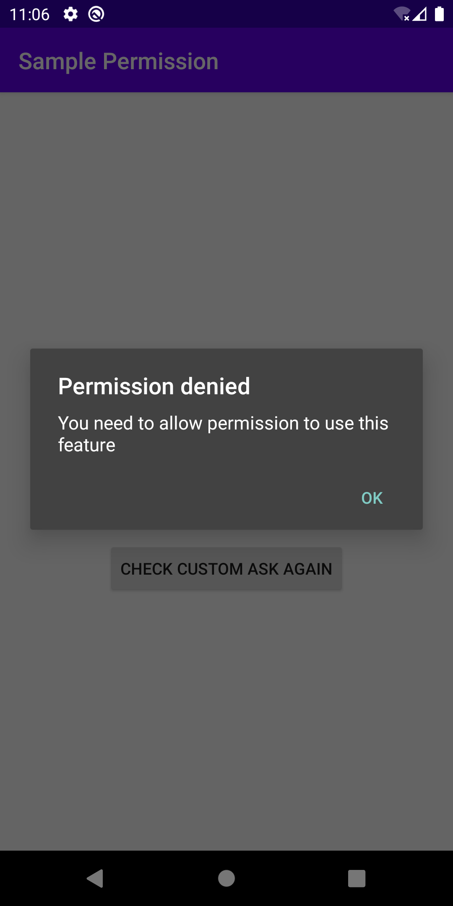
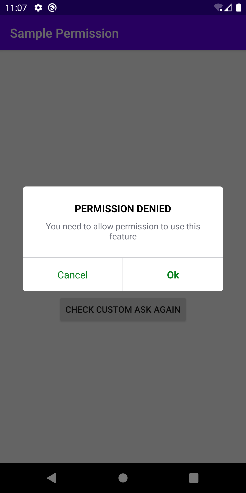

## Simple Dialog
<p>
  
  
  
  
</p>

## Simple Biometric

  
## Simple Security Preference base on Keystore and support from SDK >= 18

File store preference will look like this
```
<map>
    <string name="j7QQykBCNmmzLvsIY3t9X2rDRN4B&#10;">q5gw4m1On30+xNN7T733hDCRcch4WMiadNK5siqD8JBx4DMgV8akYMQsGFslk+uJiA==&#10;    </string>
    <string name="mrgC0FtgrFg566/4H1zxDz3Z7wTCoLcO&#10;">q5gw4m1On30+x8Q3Y4CP2i+IDoUXYlXwr+jkqmBE4XWrVDCWHQ==&#10;    </string>
</map>
```

## Simple Permission
How to use: https://github.com/HuynhXinh/simple/blob/master/app/src/main/java/com/xinhhuynh/sample/SamplePermissionActivity.kt
<p>
  
  
  
</p>

## Simple Detect Current Location
## Simple Tag App Type
